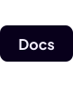

**Rediscover the joy of coding.**

Code is more dynamic, complex and intertwined than ever before. Errors cascade
out of control, things update in the wrong order, and it's all connected by
difficult, unreadable spaghetti.

No longer. Fusion introduces modern 'reactive' concepts for managing code, so
you can spend more time getting your logic right, and less time implementing
buggy boilerplate code connections.

Starting from simple roots, concepts neatly combine and build up with very little
learning curve. At every stage, you can robustly guarantee what your code will
do, and when you come back in six months, your code is easy to pick back up.

Piqued your interest? [Get going in minutes with our on-rails tutorial.](https://elttob.uk/Fusion/latest/tutorials)

## Issues & contributions

Have you read [our contribution guide](/CONTRIBUTING.md)? It's a real page turner!

We highly recommend reading it before opening an issue or pull request.

## License

Fusion is licensed freely under MIT. Go do cool stuff with it, and if you feel
like it, give us a shoutout!