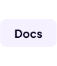

Fusion is a modern reactive UI library, built specifically for [Roblox](https://developer.roblox.com/) and [Luau](https://luau-lang.org/).

Build your UI with a declarative syntax that's easy to read and write. 
Plug in live data with simple, flexible, truly reactive state management. 
Deliver a fast, smooth experience to everyone - on mobile, console, PC or in VR. 

<a href="https://elttob.github.io/Fusion/">
Visit the Fusion documentation to learn more 
</a>

-----

## Contributing

Please read [our contribution policies](/CONTRIBUTING.md) before opening an issue or pull request.
