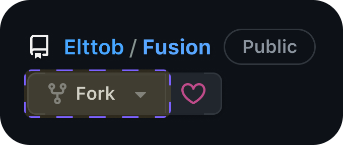
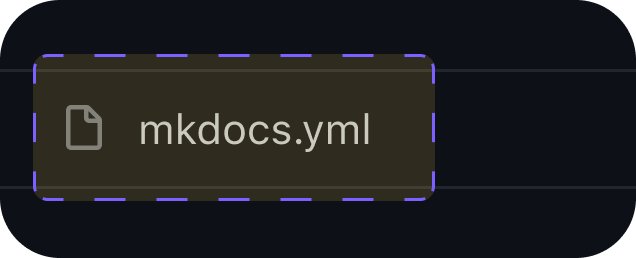
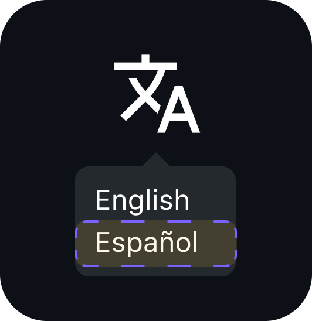
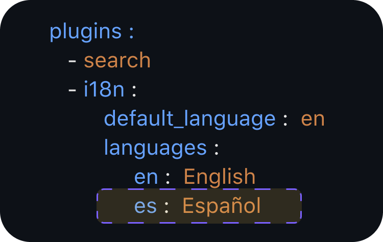
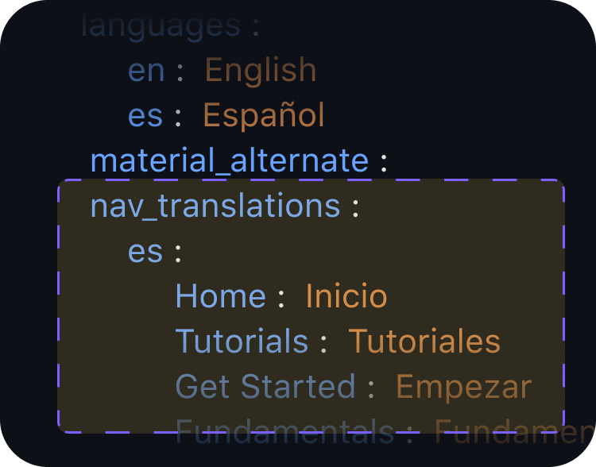
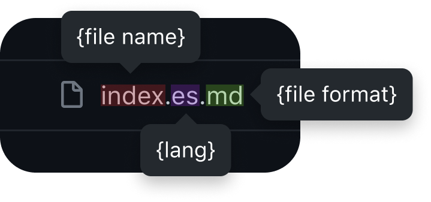
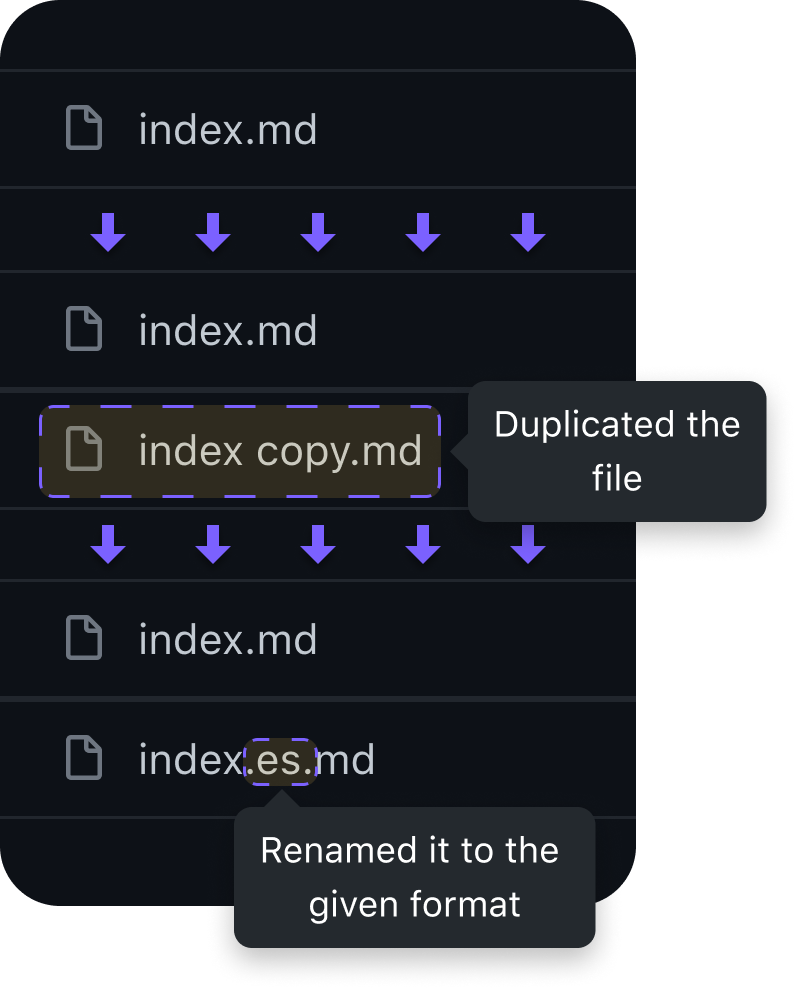
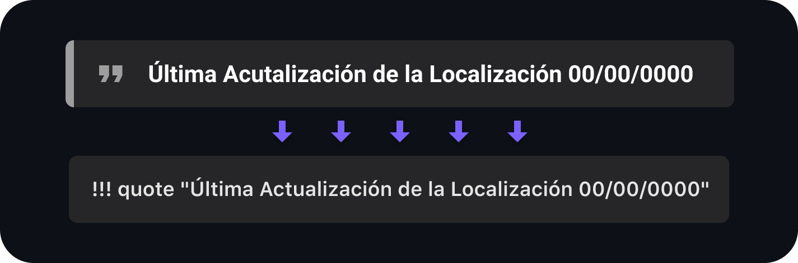

  

# Introduction

Welcome to Fusion's localization guide. In this guide you’ll find how you can contribute to the localizations of the Fusion’s docs and add a new language to the website. This guide will be brief and will try to explain everything you need to know to localize Fusion docs.

# Index

- Getting Started
- Setting up a new language
- How to localize files
- Parameters

# Getting Started

First of all, you'll need to know some stuff before proceeding to the next step, this are the requirements you need to meet:
- Have knowledge on [Luau](https://luau-lang.org/) & [Lua](https://www.lua.org/)
- Know about Programming Concepts
- Know English and the language you want to localize
- Understand how localizations work
- Understand how [Markdown](https://www.markdownguide.org/) works

Now, if you meet these requirements you’re ready to go!

# Setting up a new language 

Let’s start by forking the [Fusion repository](https://github.com/Elttob/Fusion):

  

Then, open the `mkdocs.yml` file:

  

Now it’s time to edit it. In the next images you’ll see what you need to add, in this case we’ll be adding Spanish for the purpose of explaining but you’ll need to switch it to your own language:

To add the new language to the language switcher, on `extra > alternate` add a new field using the following values:
- `name` - the name of the language, but written in that language
- `link` - the path on the website to the localizated doc
- `lang` - the language code ([2-letter](https://en.wikipedia.org/wiki/ISO_639-1))

  

  

Add a new line over `plugins > i18n > languages`, and use this format `{lang}: {name}` (these values are the ones from the previous image):

  

We'll have to localize the navigation, on `plugins > i18n > nav_translations` add a new field using `{lang}`, like in the example below (to know what strings are used for the `nav_translations` check `nav`):

  

# How to localize files

To localize a file duplicate it in the same path but change the name to `{filename}.{lang}.{fileformat}`, like in the following example:

  

  

When you're done localizing a file, at the end of it add a note to show the last time you updated the localization. Here's an example:

  

This example is in Spanish, but you'll need to do the same in the language you're localizing. The text in English is `"Last Update to the Localization 00/00/0000"`, and the format is `!!! quote "Update to the Localization {date: day/month/year}"` . This is done so readers know if what they're reading is outdated or was recently updated.

*To learn more about how the plugin to support i18n works check out [the repository](https://github.com/ultrabug/mkdocs-static-i18n)*

# Parameters

To keep all the localizations alike and mantain what the author is trying to express, there are some parameters to take into account when localizing them.

- Don't localize a file if you aren't sure of the proper way to do it
- Don't localize code, the only thing you may localize inside of code is prints and comments
- Don't localize properties, events, methods, etc
- Keep the same format, if there's a blank space keep it there!
- Rather use second person over first and third person
- Informal over formal
- If you aren't sure of a concept or a specific word, don't worry about it, you can look it up!
- Avoid refering to people based on their gender, try to choose a neutral word and if not possible use the one that suits the best in your language
- If you see a wrong or not suitable localization on the live site, feel free to create a PR to fix the mistakes
- Make use of reliable tools, such as [Wordreference](https://www.wordreference.com/) or [Cambridge Dictionary](https://dictionary.cambridge.org/)

#

  

