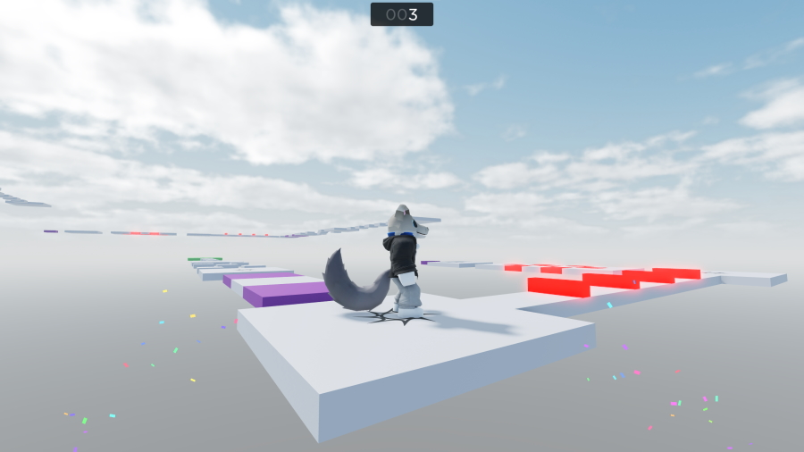

# Examples

Welcome to the Examples section! Here, you can find various open-source examples
and projects, so you can see how Fusion works in a real setting.

-----

## The Cookbook

Oftentimes, you might be stuck on a small problem. You want to create something
specific, but don't know how to do it with Fusion's tools.

The cookbook can help with that! It's a collection of snippets which show you
how to do various small tasks with Fusion, like processing arrays, applying
animations and responding to different events.

[Visit the cookbook to see what's available.](cookbook)

-----

## Open-Source Projects

### Fusion Wordle (for Fusion 0.2)

See how Fusion can be used to build a mobile-first UI-centric game, with server
validation, spring animations and sounds.

[Play and edit the game on Roblox.](https://www.roblox.com/games/12178127791/)

### Fusion Obby (for Fusion 0.1)

See how Fusion can be used to build a minimal interface for an obby, with an
animated checkpoint counter and simulated confetti.

[Play and edit the game on Roblox.](https://www.roblox.com/games/7262692194/Fusion-Obby)